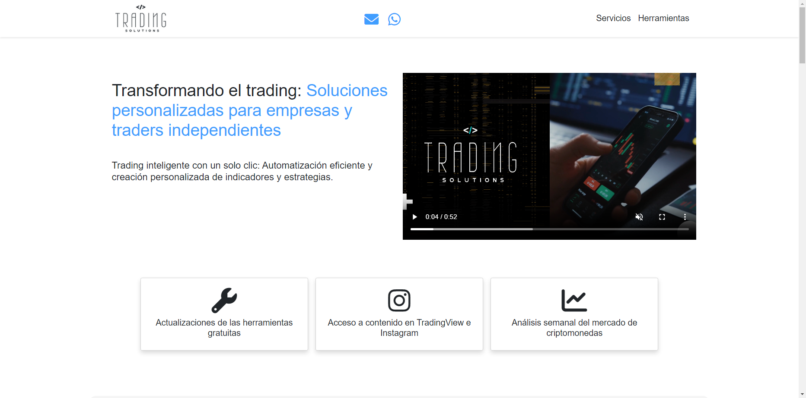
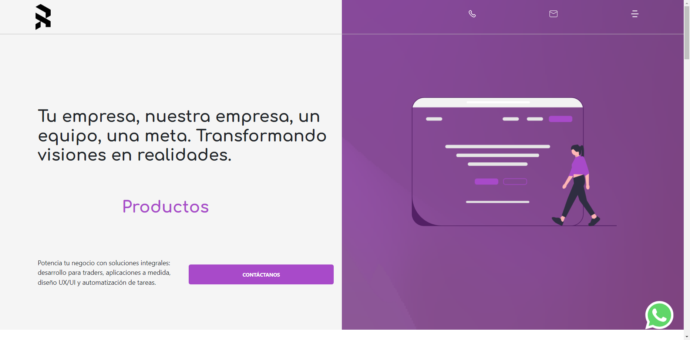
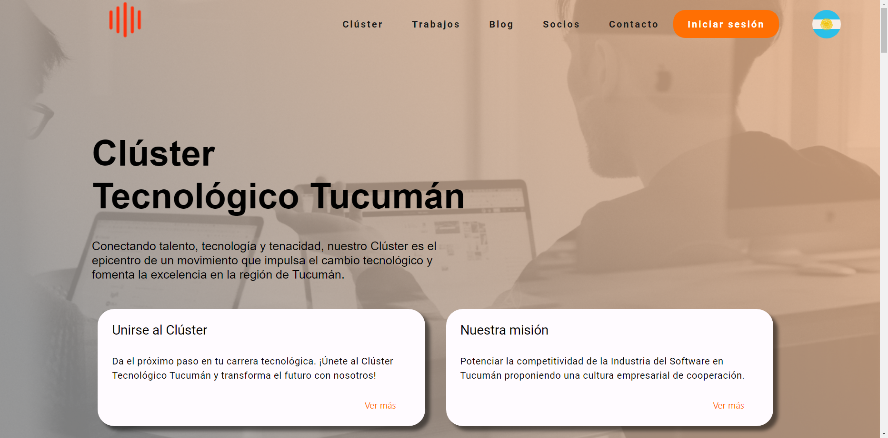
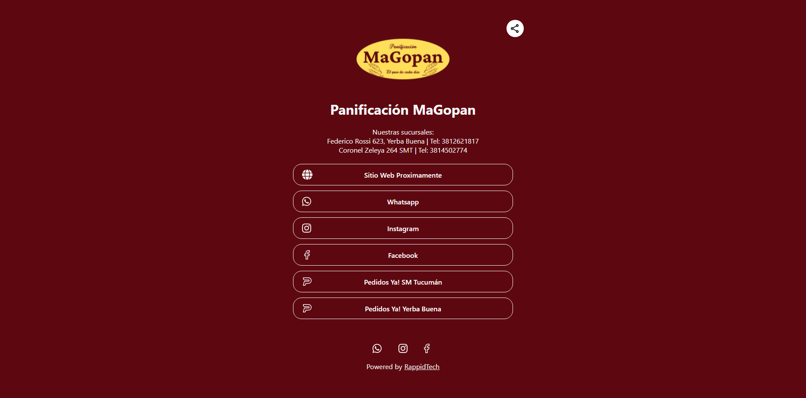

# ¡Hola! Somos RAppID Tech 👋

#### Somos una empresa tecnológica especializada en el desarrollo de software y diseño UX/UI
Ofrecemos soluciones innovadoras para la creación de aplicaciones y sitios web. Nuestro enfoque se centra en combinar creatividad del diseño con la eficiencia del desarrollo

## Tecnologías
  

    

   

   

   

 

## Encuéntranos en:
  

 

 

 

## ¿Cómo transformamos ideas en realidad?
#### 1. Contáctanos
Puedes contactarnos directamente por [whatsapp](https://api.whatsapp.com/send?phone=543814094843&text=Hola%2C%20estoy%20interesado%20en%20sus%20servicios%20de%20software)
o vía [mail](mailto:nosotros@rappidtech.com) 
#### 2. Unete a la llamada exploratoria
Realizamos una reunión donde se plantean las necesidades del cliente y se plantean diferentes enfoques.
#### 3. Definición del equipo y planteo de solución.
Una vez que contamos con toda la información, se plantea una solución y se notifica al equipo de desarrollo.
#### 4. Comienzo del desarrollo del proyecto.
Una vez acordados los plazos, comenzamos a trabajar actualizando cada etapa del proyecto según el feedback del cliente.

## Mira un poco de nuestro portfolio de proyectos:

<table style="width:100%">
<tr>
<td>
<h3>Trading Solutions</h3>

</td>
<td>
<h3>Rappid Tech</h3>

</td>
</tr>
<tr>
<td>
<h3>Clúster Tecnológico Tucumán</h3>

</td>
<td>
<h3>Panificación MaGopan</h3>

</td>
</tr>
</table>

Encuentra todos nuestros proyectos en nuestro [portfolio](https://www.behance.net/rappidtech)
 

## Proximamente RAppID Links App:
 
 

