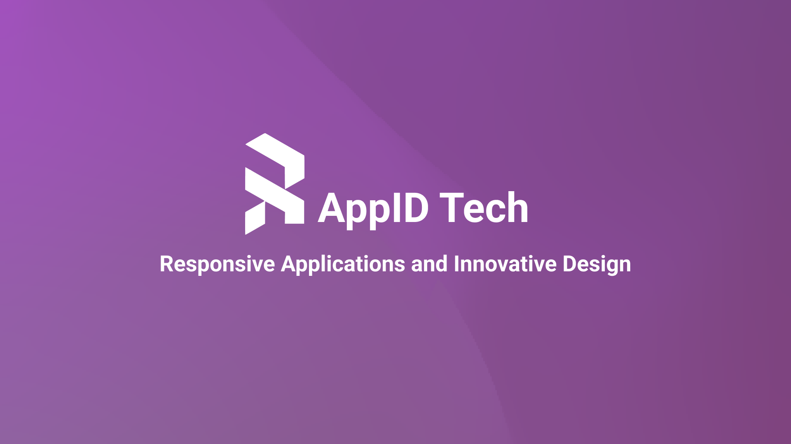
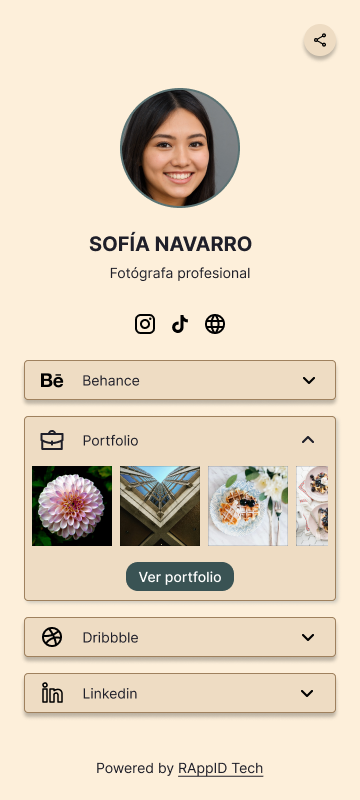

# ¡Hola! Somos RAppID Tech 👋

#### Somos una empresa tecnológica especializada en el desarrollo de software y diseño UX/UI
Ofrecemos soluciones innovadoras para la creación de aplicaciones y sitios web. Nuestro enfoque se centra en combinar creatividad del diseño con la eficiencia del desarrollo

### ¿Cómo transformamos ideas en realidad?
#### 1. Unete a la llamada exploratoria
Realizamos una reunión donde se plantean las necesidades del cliente y se plantean diferentes enfoques.
#### 2. Definición del equipo y planteo de solución.
Una vez que contamos con toda la información, se plantea una solución y se notifica al equipo de desarrollo.
#### 3. Comienzo del desarrollo del proyecto.
Una vez acordados los plazos, comenzamos a trabajar actualizando cada etapa del proyecto según el feedback del cliente.

### Nuestros planes de desarrollo web
##### StartUp Landing Page
- Diseño UX/UI Personalizado
- Diseño responsivo
- Optimización SEO
- Formulario de Contacto
##### Business Sitio Web
- Diseño UX/UI Avanzado
- Desarrollo Web profesional
- Optimización SEO Avanzada
- Integración de Blog y contenido
##### Business Sitio Web
- Diseño UX/UI Avanzado
- Desarrollo Aplicación Web
- Optimización SEO Avanzada
- Optimización de Rendimiento

### Nuestros planes de desarrollo Wordpress
##### Plan básico
- Sitio estático
- Hasta 3 páginas  (con 4 secciones)
- Formulario de contacto
- Icono de Whatsapp
- Listo en 5 días
##### Plan Rappid
- Sitio dinamico (blog)
- Hasta 5 páginas  (con 6 secciones)
- Formulario de contacto
- Icono de Whatsapp
- Listo en 5 días
##### Plan Rappid
- Página web totalmente personalizada, a medida, con funcionalidades, animaciones, y contenido que necesitas para lograr el objetivo de tu marca

## Tecnologías
  
     
  
  
 
   

## Encuéntranos en:

 
 

## Proximamente RAppID Links App:
 
